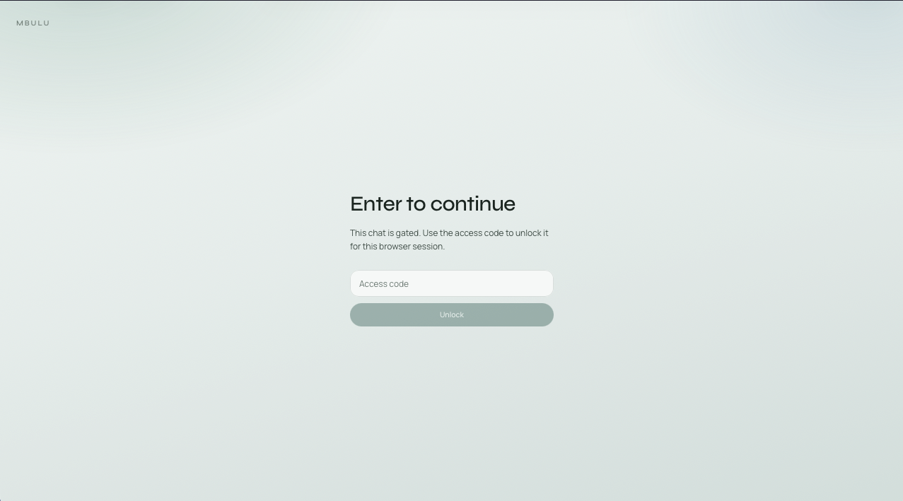
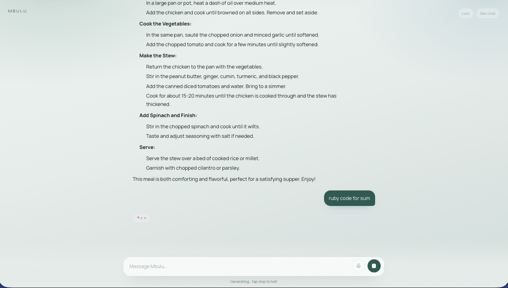
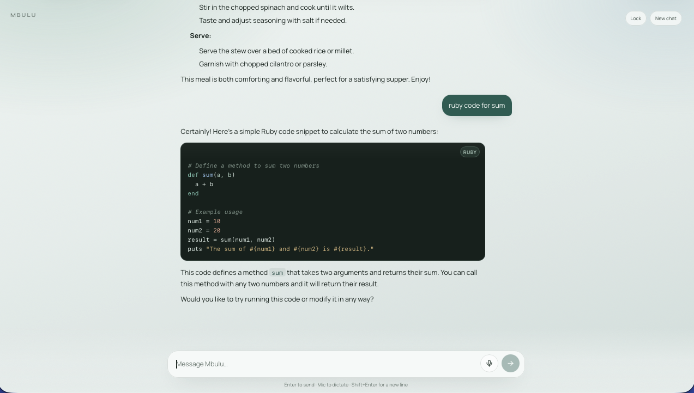
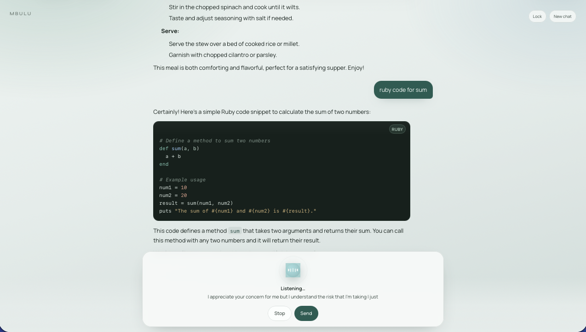

# Mbulu

Minimal Next.js chat app with streaming replies, markdown rendering, optional voice input, and a calm conversation-first UI.

## Screenshots

### Access gate

Optional unlock screen when `CHAT_ACCESS_SECRET` is set.



### Conversation

Streaming chat with markdown replies in the forest/mist UI.



### Code reply

Assistant response with a highlighted code block and language tag.



### Speech to text

Voice input via the mic control for browser speech recognition.



## Launch video

Cinematic vertical brag — typing into the composer, then a streaming reply with a highlighted code block.

<video src="brag-output-2026-09-17-063218/brag.mp4" poster="brag-output-2026-09-17-063218/brag.jpg" controls playsinline width="360"></video>

[Watch / download MP4](brag-output-2026-09-17-063218/brag.mp4) · [Poster](brag-output-2026-09-17-063218/brag.jpg)

## Features

- Streaming chat against an OpenAI-compatible API
- Markdown responses with language-aware code highlighting
- Browser speech-to-text (where supported)
- Local conversation memory in the browser
- Optional access code gate, origin allowlist, and rate limits
- Stop control for in-progress generations

## Requirements

- Node.js 20+
- An OpenAI-compatible chat endpoint

## Setup

```bash
cp .env.example .env.local
npm install
npm run dev
```

Open [http://localhost:3000](http://localhost:3000).

Configure values in `.env.local` only. Never commit that file.

## Docker

Requires Docker and Docker Compose. Env is read at **runtime** (not baked into the image).

```bash
cp .env.example .env.local   # fill CHAT_* values
docker compose up --build
```

App: [http://localhost:3000](http://localhost:3000).

```bash
docker compose down
# or one-shot without Compose:
docker build -t mbulu:local .
docker run --rm -p 3000:3000 --env-file .env.local mbulu:local
```

Set `CHAT_ALLOWED_ORIGINS` to the origin browsers use (for local Compose, `http://localhost:3000`).

## Environment

Copy `.env.example` and fill in:

| Variable | Purpose |
| --- | --- |
| `CHAT_API_KEY` | Bearer token for the chat provider |
| `CHAT_BASE_URL` | OpenAI-compatible API base URL (usually ends with `/v1`). Prefer host-local Ollama (`http://127.0.0.1:11434/v1` or `http://host.docker.internal:11434/v1` from containers). |
| `CHAT_MODEL` | Model id to use |
| `CHAT_SYSTEM_PROMPT` | System prompt for the assistant |
| `CHAT_ACCESS_SECRET` | Optional access code required to use the app |
| `CHAT_ALLOWED_ORIGINS` | Comma-separated allowed browser origins |
| `CHAT_RATE_LIMIT_PER_MIN` | Max chat requests per IP per minute |
| `CHAT_RATE_LIMIT_PER_HOUR` | Max chat requests per IP per hour |
| `CHAT_MAX_MESSAGES` | Max messages accepted in one request payload |
| `CHAT_MAX_MESSAGE_CHARS` | Max characters per message |
| `CHAT_CONTEXT_MESSAGES` | How many recent messages are sent to the model |

## Scripts

```bash
npm run dev         # local development
npm run build       # production build
npm run start       # serve the production build
npm run lint        # lint
npm run typecheck   # TypeScript check
npm test            # unit tests
npm run test:watch
```

## CI / CD

GitHub Actions (`CI`) runs on every push and pull request to `main`:

- `npm ci`, lint, typecheck, tests, production build
- Docker image build (no push)

Production deploys are **not** done by GitHub Actions. Use **Kamal** (see below) to build, push to GHCR, and deploy behind Caddy on the VPS.

## Notes

- Conversation history is stored in the browser (`localStorage`), not on the server.
- Voice input uses the Web Speech API and works best in Chromium-based browsers.
- Keep secrets out of git; only `.env.example` should document variable names.
